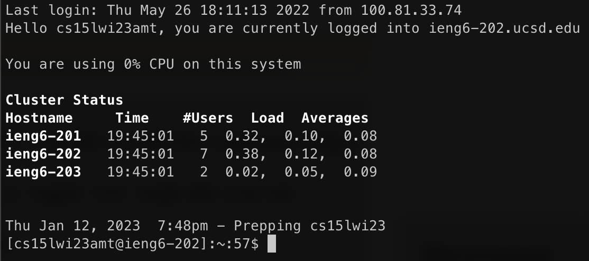

# Lab Report 1 - Remote Access and Filesystem

This is a tutorial on how to remote login to `ieng6` with your course-specific account. There are three steps:

1. [Download VSCode](#download-vscode)
2. [Remote Login](#remote-login-to-ieng6)
3. [Run Commands](#run-commands)

---

## Download VSCode

Visual Studio Code is a lightweight code editor that comes with a terminal. First, download VSCode from [here](https://code.visualstudio.com/download).

Then navigate to your `Downloads` folder and double click on the installer. Follow the instructions, then open up VSCode.
You should see the Get Started page, like in the image below:


## Remote Login to `ieng6`

Now that you have VSCode installed and open, open up the Terminal inside it. On the menu bar, click Terminal --> New Terminal.

Have your course-specific account ready for this next step. In the terminal enter the following command:

`ssh cs15lwi23zz@ieng6.ucsd.edu`

Replace the "zz" with the unique letters in your course-specific account username. A message will appear the first time you log in asking whether you want to continue connecting:
```
The authenticity of host 'ieng6.ucsd.edu (128.54.70.227)' can't be established.
RSA key fingerprint is SHA256:ksruYwhnYH+sySHnHAtLUHngrPEyZTDl/1x99wUQcec.
Are you sure you want to continue connecting (yes/no/[fingerprint])?
```
Enter "yes".

Now enter the password for your account. Then, you should see something similar to the following appear on your terminal. This means you have successfully logged in.



## Run Commands

Now let's try running some commands on `ieng6`. There are many commands you can try out. Here are some ideas:
* Use `pwd` to print your current working directory.
* Use `mkdir` to create a new folder and `cd` to navigate to your new folder.
* Use `cd ..` to navigate to the parent directory of your current working directory.
* Use `ls` to view the files in your current working directory. Add `-a` to see all hidden files, and `-l` to see the files in a large list with more information about each file.

Here is an example in which a new folder and new file are created and then removed:
