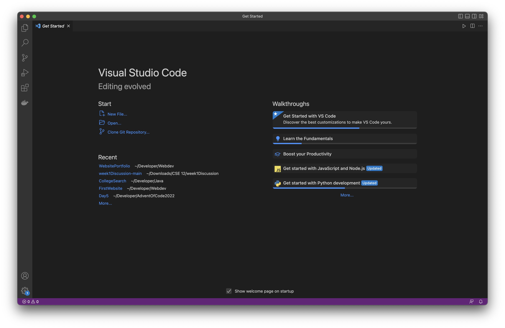

# Lab Report 1 - Remote Access and Filesystem

This is a tutorial on how to remote login to `ieng6` with your course-specific account. There are three steps:

1. Download VSCode
2. Remote Login
3. Run Commands

---

## Download VSCode

Visual Studio Code is a lightweight code editor that comes with a terminal. First, download VSCode from [here](https://code.visualstudio.com/download).

Then navigate to your `Downloads` folder and double click on the installer. Follow the instructions, then open up VSCode.
You should see the Get Started page, like in the image below:

