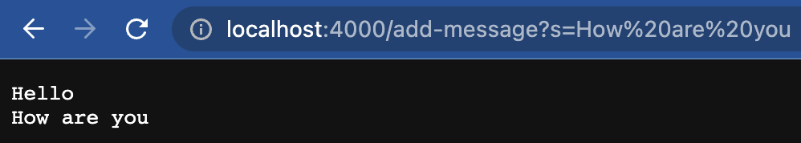
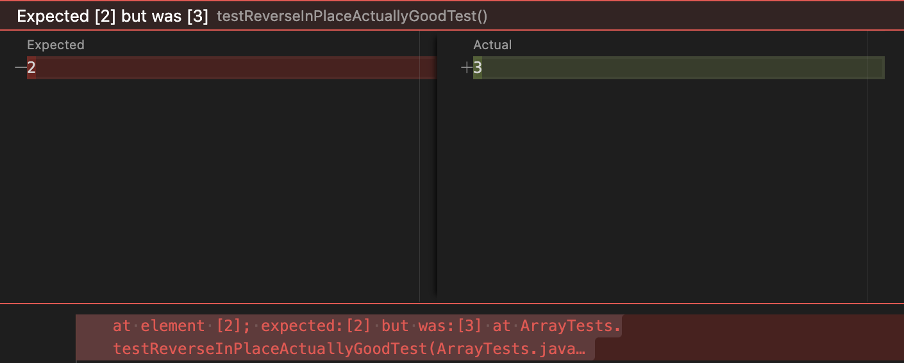

# Lab Report 2 - Servers and Bugs

## Part 1 - StringServer

**Server.java** (Reused from Week 2 Lab)

```Java
// A simple web server using Java's built-in HttpServer

// Examples from https://dzone.com/articles/simple-http-server-in-java were useful references

import java.io.IOException;
import java.io.OutputStream;
import java.net.InetSocketAddress;
import java.net.URI;

import com.sun.net.httpserver.HttpExchange;
import com.sun.net.httpserver.HttpHandler;
import com.sun.net.httpserver.HttpServer;

interface URLHandler {
    String handleRequest(URI url);
}

class ServerHttpHandler implements HttpHandler {
    URLHandler handler;
    ServerHttpHandler(URLHandler handler) {
      this.handler = handler;
    }
    public void handle(final HttpExchange exchange) throws IOException {
        // form return body after being handled by program
        try {
            String ret = handler.handleRequest(exchange.getRequestURI());
            // form the return string and write it on the browser
            exchange.sendResponseHeaders(200, ret.getBytes().length);
            OutputStream os = exchange.getResponseBody();
            os.write(ret.getBytes());
            os.close();
        } catch(Exception e) {
            String response = e.toString();
            exchange.sendResponseHeaders(500, response.getBytes().length);
            OutputStream os = exchange.getResponseBody();
            os.write(response.getBytes());
            os.close();
        }
    }
}

public class Server {
    public static void start(int port, URLHandler handler) throws IOException {
        HttpServer server = HttpServer.create(new InetSocketAddress(port), 0);

        //create request entrypoint
        server.createContext("/", new ServerHttpHandler(handler));

        //start the server
        server.start();
        System.out.println("Server Started! Visit http://localhost:" + port + " to visit.");
    }
}
```


  
**StringServer.java**

```Java
import java.io.IOException;
import java.net.URI;
import java.util.ArrayList;

class Handler implements URLHandler {
    ArrayList<String> messages = new ArrayList<>();

    public String handleRequest(URI url) {
        if (url.getPath().equals("add-message")) {
            String[] params = url.getQuery().split("=");
            if (params[0].equals("s")) {
                messages.add(params[1]);
            }
            return getMessages();
        }
        return "404 Not Found!";
    }

    private String getMessages() {
        String display = "";
        for (String s : messages) {
            display += s + "\n";
        }
        return display;
    }
}

class StringServer {
    public static void main(String[] args) throws IOException {
        if(args.length == 0){
            System.out.println("Missing port number! Try any number between 1024 to 49151");
            return;
        }

        int port = Integer.parseInt(args[0]);

        Server.start(port, new Handler());
    }
}
```


Using `/add-message` once at `http://localhost:4000/add-message?s=Hello`:


In the code, the method `handleRequest()` is called with the `URI` object containing the URL I entered. 
Next, the `getPath()` method is called on the `URI` object and the result is compared to the path `/add-message` with `.equals()`.
Since the path matches, the code checks if the given parameter is `s`, and since it is, adds its value to the class field `messages`, an 
ArrayList of strings which is currently empty.
Finally, the `getMessages()` method is called, which is a private method I wrote that puts all the messages stored in the `messages`
ArrayList into a string, separated by new line characters. This string is returned by the `handleRequest()` method.
The value of the `messages` field changes from an empty ArrayList to a list with one string, `"Hello"`.


Using `/add-message` a second time at `http://localhost:4000/add-message?s=How are you`:



In the code, the method `handleRequest()` is called with the `URI` object containing this new URL I entered. 
Next, the `getPath()` method is called on the `URI` object and the result is compared to the path `/add-message` with `.equals()`.
Since the path matches, the code checks if the given parameter is `s`, and if so, adds its value to the class field `messages`, an 
ArrayList of strings which currently has one string, `"Hello"`.
Finally, the `getMessages()` method is called, and its return string is returned by the `handleRequest()` method.
The value of the `messages` field changes from an ArrayList with one string to a list with two strings, `"Hello"` and `"How are you"`.


---


## Part 2 - Bug

### **Failure-inducing input:**

```Java
@Test
public void testReverseInPlaceActuallyGoodTest() {
  int[] input1 = {1, 2, 3, 4};
  ArrayExamples.reverseInPlace(input1);
  assertArrayEquals(new int[]{4, 3, 2, 1}, input1);
}
```


### **Non failure-inducing input:**

```Java
@Test 
public void testReverseInPlace() {
  int[] input1 = { 3 };
  ArrayExamples.reverseInPlace(input1);
  assertArrayEquals(new int[]{ 3 }, input1);
}
```


### **Symptom:**

First input (failure-inducing):



Second input (non failure-inducing):


### **Bug:**

Original code:

```Java
// Changes the input array to be in reversed order
static void reverseInPlace(int[] arr) {
  for(int i = 0; i < arr.length; i += 1) {
    arr[i] = arr[arr.length - i - 1];
  }
}
```

Fixed code:

```Java
// Changes the input array to be in reversed order
static void reverseInPlace(int[] arr) {
  // Do the reversing in a new array
  int[] newArr = new int[arr.length];

  for(int i = 0; i < arr.length; i += 1) {
    newArr[i] = arr[arr.length - i - 1];
  }

  // Copy the reversed numbers back into the original array
  for (int i = 0; i < arr.length; i++) {
    arr[i] = newArr[i];
  }
}
```

In the original code, the reversing would work as the last elements are copied to the first few spots in the array until the halfway 
point, and then it would try to copy over the first half of the array to the second half, but the first half would no longer have the 
old values that need to be put in the second half of the array. Using a new array to add the reversed elements to and then copying 
over the data from the new array back to the original array addresses the issue because it prevents the error of changing the first few 
elements of the array before they can be copied to the end of the array. 


---


## Part 3 - What I learned

In Week 2's lab, I learned about how Java servers are set up and run, and that when we enter a URL we send a request to a server, which
in turn brings us a response. I also learned how to `ssh` into `ieng6` and manipulate files on it, and even host my Java server on it so
that others in the class can access the page and send it requests. Finally, I learned how to use JUnit to create meaningful tests with
different sized inputs and catch and fix bugs in my code in Week 3's lab. I realized that code producing expected output for a few inputs 
does not mean that the code is fully functioning for ALL legal inputs.
