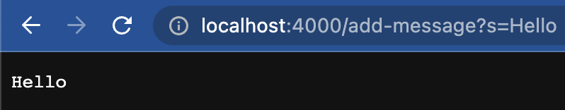

# Lab Report 2 - Servers and Bugs

## Part 1 - StringServer

**Server.java** (Reused from Week 2 Lab)

<details>
  
<summary>Click to expand</summary>

```Java
// A simple web server using Java's built-in HttpServer

// Examples from https://dzone.com/articles/simple-http-server-in-java were useful references

import java.io.IOException;
import java.io.OutputStream;
import java.net.InetSocketAddress;
import java.net.URI;

import com.sun.net.httpserver.HttpExchange;
import com.sun.net.httpserver.HttpHandler;
import com.sun.net.httpserver.HttpServer;

interface URLHandler {
    String handleRequest(URI url);
}

class ServerHttpHandler implements HttpHandler {
    URLHandler handler;
    ServerHttpHandler(URLHandler handler) {
      this.handler = handler;
    }
    public void handle(final HttpExchange exchange) throws IOException {
        // form return body after being handled by program
        try {
            String ret = handler.handleRequest(exchange.getRequestURI());
            // form the return string and write it on the browser
            exchange.sendResponseHeaders(200, ret.getBytes().length);
            OutputStream os = exchange.getResponseBody();
            os.write(ret.getBytes());
            os.close();
        } catch(Exception e) {
            String response = e.toString();
            exchange.sendResponseHeaders(500, response.getBytes().length);
            OutputStream os = exchange.getResponseBody();
            os.write(response.getBytes());
            os.close();
        }
    }
}

public class Server {
    public static void start(int port, URLHandler handler) throws IOException {
        HttpServer server = HttpServer.create(new InetSocketAddress(port), 0);

        //create request entrypoint
        server.createContext("/", new ServerHttpHandler(handler));

        //start the server
        server.start();
        System.out.println("Server Started! Visit http://localhost:" + port + " to visit.");
    }
}
```
  
</details>
  
**StringServer.java**

```Java
import java.io.IOException;
import java.net.URI;
import java.util.ArrayList;

class Handler implements URLHandler {
    ArrayList<String> messages = new ArrayList<>();

    public String handleRequest(URI url) {
        if (url.getPath().equals("add-message")) {
            String[] params = url.getQuery().split("=");
            if (params[0].equals("s")) {
                messages.add(params[1]);
            }
            return getMessages();
        }
        return "404 Not Found!";
    }

    private String getMessages() {
        String display = "";
        for (String s : messages) {
            display += s + "\n";
        }
        return display;
    }
}

class StringServer {
    public static void main(String[] args) throws IOException {
        if(args.length == 0){
            System.out.println("Missing port number! Try any number between 1024 to 49151");
            return;
        }

        int port = Integer.parseInt(args[0]);

        Server.start(port, new Handler());
    }
}
```

Using `/add-message` once at `http://localhost:4000/add-message?s=Hello`:



Using `/add-message` a second time at `http://localhost:4000/add-message?s=How are you`:


