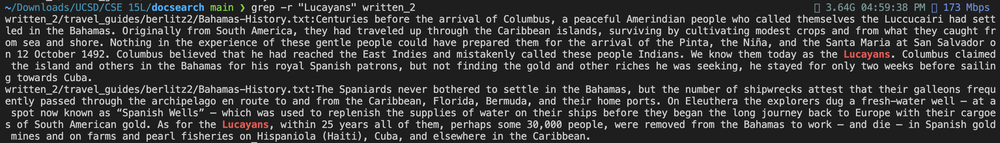
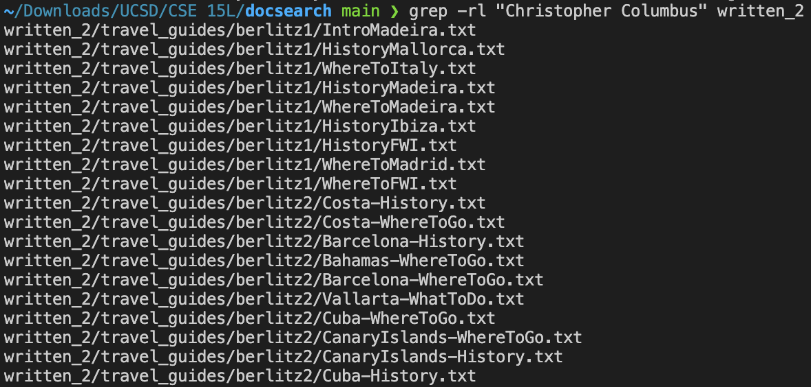
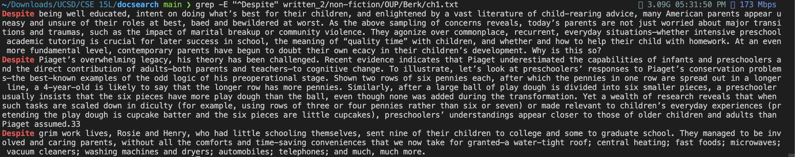
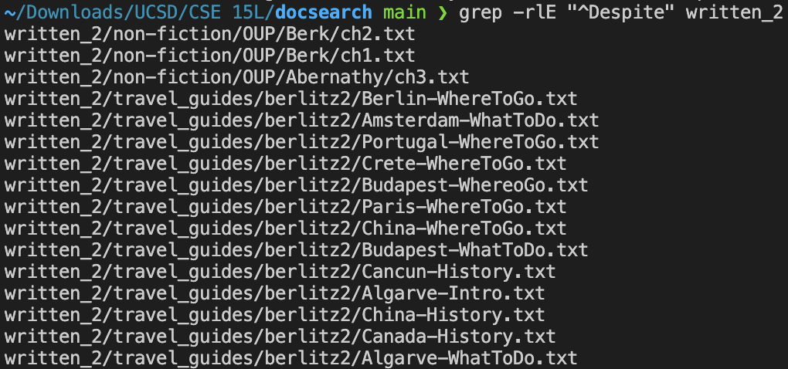
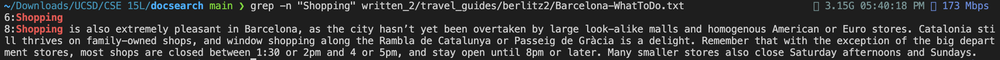
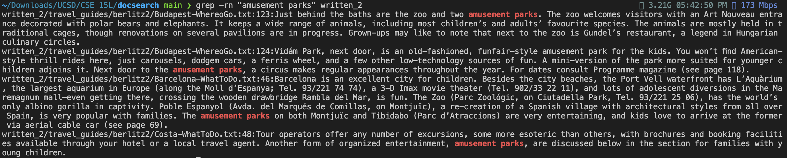
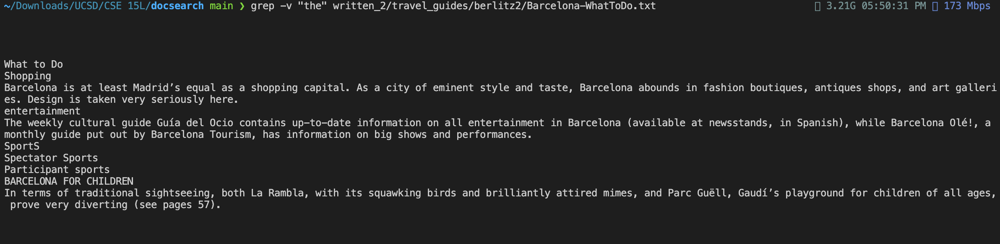

# Lab Report 3 - Researching Commands

## Grep Command

### [1] (Source: ChatGPT)

```bash
grep -r "search_string" directory/
```

The `-r` tag means search recursively, or search all files and folders within a directory including 
subfolders.



Combining the `-r` tag with the `-l` tag that lists the files that contain the string:



### [2] (Source: ChatGPT, [linuxize.com](https://linuxize.com/post/regular-expressions-in-grep/))

```bash
grep -E "^[0-9]+$" file.txt
```

The `-E` tag means to search for a regular expression. A regular expression is a string with symbols 
that represent certain searching criteria. For example, the `^` (caret) symbol means match the string 
following the symbol if it is located at the start of a line.



We can also search for all files in a directory containing a certain regular expression with `grep -rlE
<regex> <directory>`:



### [3] (Source: ChatGPT)

```bash
grep -n "search_string" directory/
```

The `-n` tag means to get the line number in a file where a match was found.



We can combine it with the `-r` tag to find all the line numbers of the files in the directory containing 
the string:



### [4] (Source: ChatGPT)

```bash
grep -v "search_string" directory/
```

The `-v` tag means to reverse the match, or show all the lines in a file that _don't_ contain the string.



Here we search for all lines that don't contain the word "the", but one line with a capitalized "The" 
appears because the grep command by default is case-sensitive. To make it ignore case, we can use the
`-i` tag. This time, let's look for all lines that don't contain "the" OR "a", case-insensitive:


