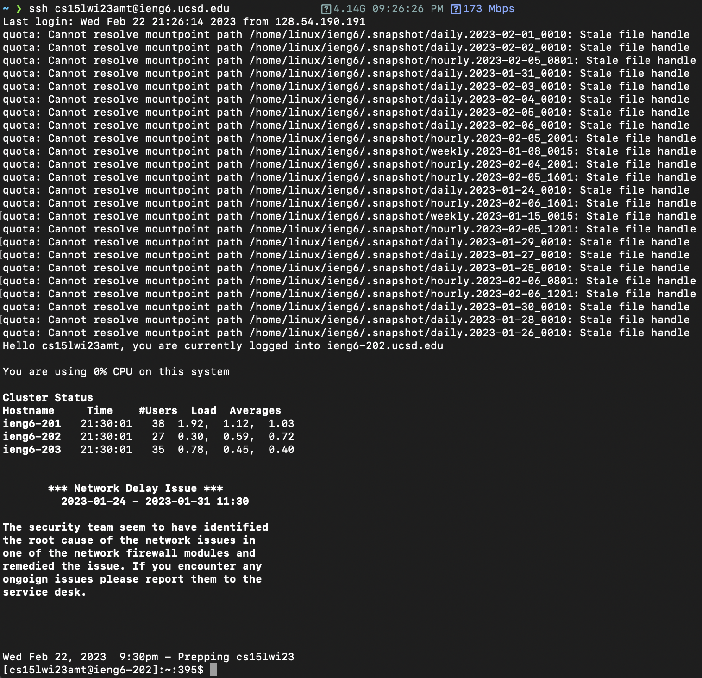
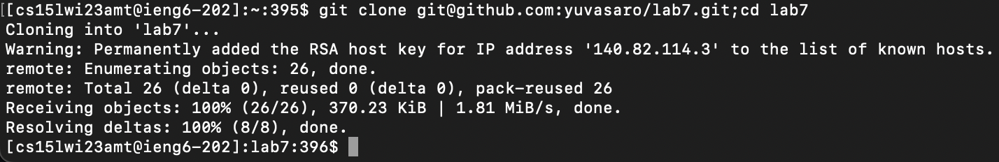
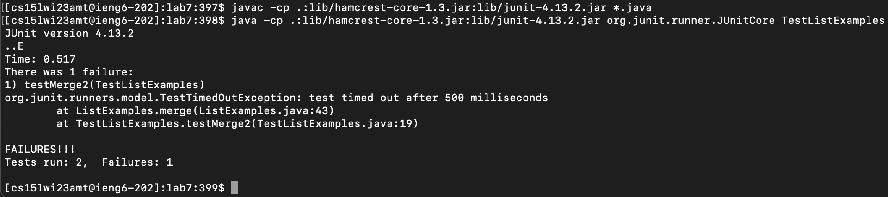
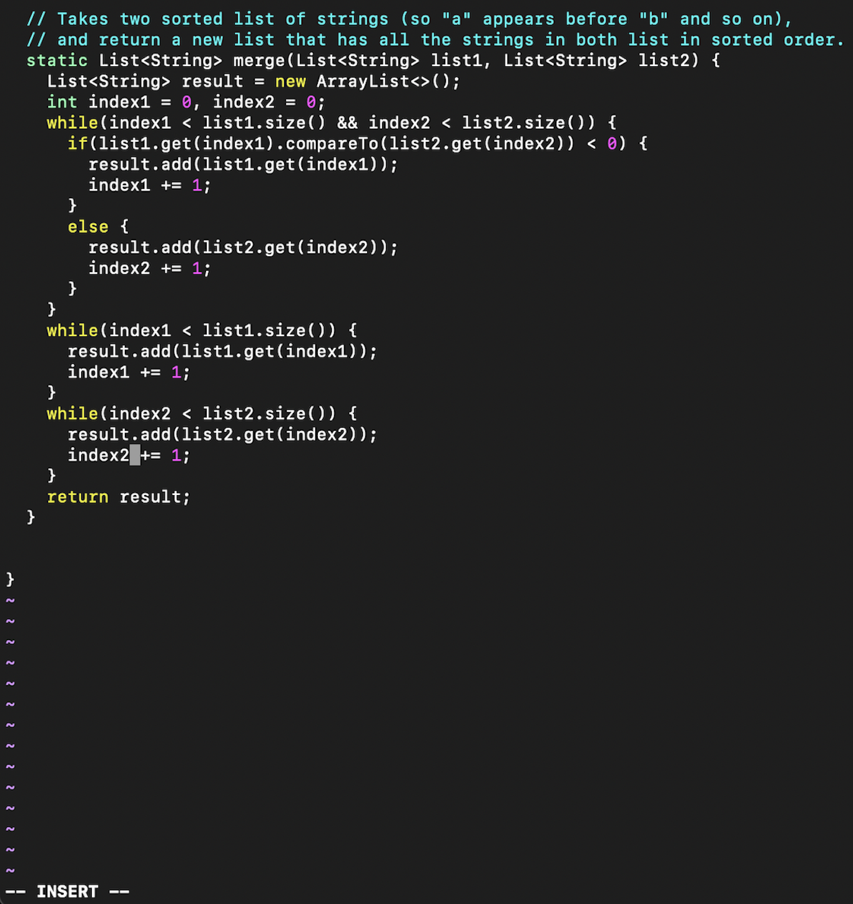
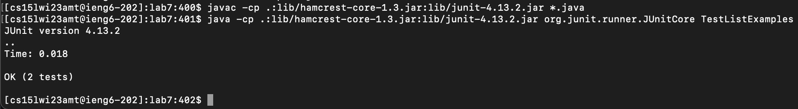
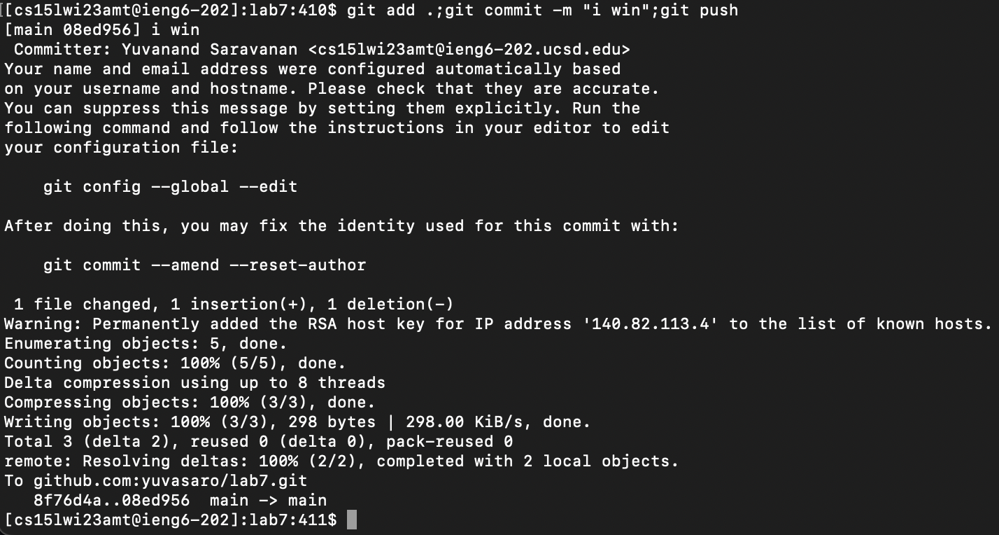

# Lab Report 4 - CSE Labs Done Quick

## Steps (Post-setup) (Source: [Week 7 Lab](https://ucsd-cse15l-w23.github.io/week/week7/))

### 1. Log into ieng6

Keys pressed: `<up> <up> <enter>`

I used the up arrow twice to access the `ssh <ieng6>` command from my command history and hit enter to 
execute it.

---

### 2. Clone your fork of the repository from your Github account

Keys pressed: `^R git c <enter>`

I used `^R` to enter `reverse-i-search` and typed in `git c` to search my command history and find the
`git clone <url>;cd <repo>` command that I previously executed. This both clones the `lab7` repository 
and changes directory into the repository's folder.

---

### 3. Run the tests, demonstrating that they fail

Keys pressed: `^R javac <enter> ^R java<space> <enter>`

I used `^R` again to search my command history for the `javac -cp <path> *.java` command that compiles 
all the `.java` files in the repository, then executed it with `<enter>`. Then I used `^R` once more to 
search for the `java -cp <path> <tester class>` command to run the JUnit tests in the tester file.

---

### 4. Edit the code file to fix the failing test

*Note: screenshot shows editing of file in progress– the rest of the keys pressed exit the editor*

Keys pressed: `vim L <tab> <enter> i <delete> 2 <esc> :wq! <enter>`

To edit the `ListExamples.java` file to fix the bug in the code, I entered `vim L` and then hit tab to
autocomplete the filename `ListExamples.java`. Then I hit enter to open the editor. Inside the editor,
my cursor was already at the specific spot in the buggy line of code that needed to be fixed. I just
had to enter `i` to enter insert mode and `<delete> 2` to change `index1` to `index2` in the code so
that the correct variable is incremented and an infinite loop doesn't happen. To save and exit the
file, I first clicked escape and then entered `:wq!` to write to the file and quit it by force.

---

### 5. Run the tests, demonstrating that they now succeed

Keys pressed: `<up> <up> <up> <enter> <up> <up> <up> <enter>`

I used the up arrow to go up in my command history to access and rerun the `javac` command I entered
in step 3. This ensures that the edit I made to the `ListExamples.java` file results in a successful 
compilation. Then I used the up arrow three times again to access the `java` command that runs the
tester file. This time the tests passed.

---

### 6. Commit and push the resulting change to your Github account (you can pick any commit message!)

Keys pressed: `^R git a <enter>`

I used `^R` to search my command history for the `git add .;git commit -m <message>;git push` command
that I previously entered. This command performs three steps with just one line: adding the edit I
made, committing the change to the local repository, and pushing the local changes to the remote
repository.
